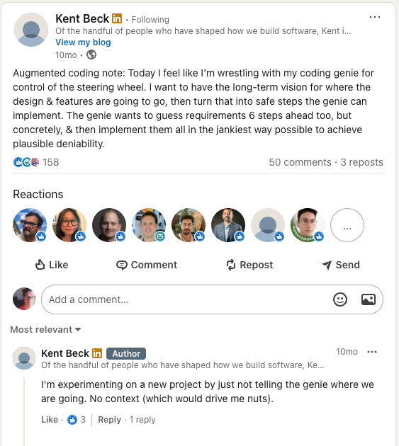

<!-- slide: 0 -->
# Cookin w/ Gas Town {data-background="images/busytown-gastown.png" data-background-size="contain" data-background-position="center"}

<div style="font-family: 'Georgia', serif; font-size: 0.6em; font-style: italic; opacity: 0.85; margin-top: -0.3em;">Pt1 of a Conductor's Dilemma</div>

#### Whit Morriss
#### Six Feet Up

::: notes
- Intro: who you are, what you do at Six Feet Up
- Part 1 — the dilemma: how do you get multiple AI agents to do
  real work without everything falling apart?
- Today we're going to cook with Gas Town, a system we built to answer that question
:::

<!-- slide: 1 -->
#

{.r-stretch}

::: notes
- Kent Beck wrestling with the same problem — coding agents are powerful
  but controlling them is the hard part
- This is what motivated us to build Gas Town
- Pause and let the audience read it
:::

<!-- slide: 2 -->
# 99 Problems, Off by 1 {data-background="images/future-is-legion.jpg"}

> "One agent is a conversation.
> Two agents is a negotiation.
> Three agents is a _government_."
>
> — _the mayor_

::: notes
- Single agent: you prompt, it responds. Easy.
- Two agents: now they need to agree on something. Handoff, context, who does what.
- Three+: you need structure. Roles, protocols, visibility.
- You can't micromanage agents and you can't let them free-range.
  You need a system that lets them self-organize around real constraints.
- This is the problem Gas Town solves.
:::

<!-- slide: 3 -->
# Why Orchestrate {data-background="images/4.png"}

> "Patterns for communication are patterns for parallelism."

::: notes
- This is the thesis of the whole talk
- If you want agents to work in parallel, you need communication patterns first
- Not bureaucracy — infrastructure. The same way CSP, actor models, and
  message queues solved concurrency for software, roles and protocols
  solve it for agents
- Every design choice in Gas Town flows from this: mail, hooks, beads,
  roles — they exist so agents can work simultaneously without stepping
  on each other
- The communication pattern IS the parallelism pattern
:::

<!-- slide: 4 -->
# What is Gas Town {data-background="images/5.png"}

A multi-agent orchestration system for software teams.

- **Roles**: mayor, witness, refinery, polecats
- **Work units**: beads (trackable, auditable)
- **Projects**: rigs (worktrees with shared state)
- **Comms**: hooks, mail, handoffs

::: notes
- Gas Town is not a framework — it's an operating model
- Built on Claude Code, git worktrees, and plain files
- Each role has a specific job: mayor coordinates, witness reviews,
  refinery builds, polecats handle parallel tasks
- Beads are the unit of work — like tickets but lighter, tracked in the ledger
- Rigs are project containers — each agent gets their own worktree
- Communication is async: mail for messages, hooks for assignments
:::

<!-- slide: 5 -->
# The Cast {data-background="images/busytown-joe.png"}

| Role | Job | Think of it as... |
|------|-----|-------------------|
| **Mayor** | Coordinate, delegate, decide | Tech lead |
| **Witness** | Review, verify, approve | QA / code review |
| **Refinery** | Build, implement, merge | Senior dev |
| **Polecats** | Parallel tasks, scouting | Junior devs |

::: notes
- Mayor is the drive shaft — checks hook, executes, delegates
- Witness watches for quality, catches mistakes before they land
- Refinery does the heavy lifting — implementation, merges, PRs
- Polecats are fungible — spin up N of them for parallel work
- Each role runs as a separate Claude Code session with its own context
- They communicate through the mail system, not through shared context
:::

<!-- slide: 6 -->
# The Engine {data-background="images/6.png"}

```{=html}
<pre class="mermaid" style="max-height: 75vh;">
graph LR
    A["User Request"] --> B["Mayor creates bead"]
    B --> C["Slings to rig"]
    C --> D["Agent hooks work"]
    D --> E["Work happens"]
    E --> F["Logged to ledger"]
</pre>
```

::: notes
- This is the propulsion principle: when an agent finds work on their
  hook, they execute. No confirmation. No waiting.
- The hook IS your assignment
- Beads flow through the system like work orders
- Every completion is recorded — the ledger is the audit trail
- If an agent gets stuck, it hands off. Context is preserved in the bead.
- The failure mode is stopping to ask "should I do this?" — that's
  what kills throughput
:::

<!-- slide: 7 -->
# Let's Cook {data-background="images/agent-at-home-0.png"}

<DEMO>

::: notes
Demo target: conclave — a real incident response platform built with Gas Town.
Not a toy. Agents have been shipping real PRs on this rig.

Demo sequence (showoff steps):
1. gt rig status conclave — show who's running
2. bd create — make a real bead for conclave
3. gt sling — send it to the refinery
4. Watch the refinery pick it up, do the work
5. Witness reviews, mail flows
6. bd show — the ledger entry
:::

<!-- slide: 8 -->
# What Makes It Work {data-background="images/busytown-gastown.png"}

- **Constraint** over control
- **Protocol** over micromanagement
- **Visibility** over trust

::: notes
- Gas Town works because agents have clear roles and clear protocols
- The mayor doesn't write code — it creates beads and slings them
- The witness doesn't build — it reviews
- Constraint is what makes nondeterministic systems useful
- Same principle as the AllThings AI talk: determinism from
  nondeterministic systems through structure
:::

<!-- slide: 9 -->
# Next Time + Talk To Me {data-background="images/3.png"}

**Pt2**: failure modes, scaling polecats, cross-rig coordination

Whit Morriss — Six Feet Up

::: notes
- Part 2 will cover the hard problems: what happens when an agent
  fails mid-task, how do you scale beyond one rig, what happens
  when the witness and refinery disagree
- Thank you, questions welcome
- Gas Town is built on Claude Code — ask me how to get started
:::
